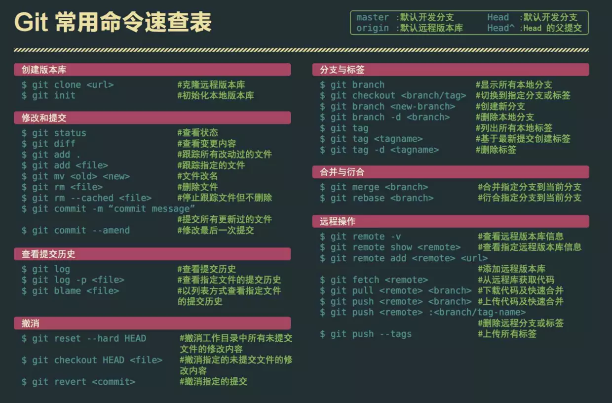

## Git常用命令

>   如何从基于A创建B分支,并切换到新创建到分支B

    git checkout A 
    git branch B
    git checkout B
    或者
    git checkout A
    git checkout -b B

> 如何合并分支，如把A分支合并到B分支？

首先`git checkout B`切换到B分支即`目标分支`（开发时通常需要新建一个自分支A，然后再合并到B），然后执行`git merge A`即可
> 如何重命名分支？

    git branch -m oldBranchName newBranchName

> 如何新建远端分支并且把当前本地分支B推送push上去？(**远端没有B分支**)

    git push --set-upstream origin  B